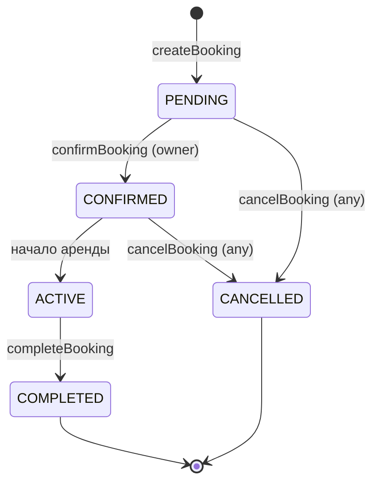

# 🗄️ Сущности базы данных

## users

Основная сущность пользователя. Нет разделения на роли — один юзер может и сдавать и арендовать.

| Поле       | Тип            | Описание                                         |
| ---------- | -------------- | ------------------------------------------------ |
| id         | UUID PK        | Первичный ключ                                   |
| email      | VARCHAR UNIQUE | Email (логин)                                    |
| password   | VARCHAR        | Хэш пароля                                       |
| phone      | VARCHAR        | Телефон (показывается после подтверждения брони) |
| first_name | VARCHAR        | Имя                                              |
| last_name  | VARCHAR        | Фамилия                                          |
| avatar_url | VARCHAR        | Ссылка на фото профиля (в МВП base64)            |
| created_at | TIMESTAMP      | Дата регистрации                                 |

---

## user_documents

Документы пользователя для верификации.

| Поле                | Тип             | Описание                                  |
| ------------------- | --------------- | ----------------------------------------- |
| id                  | UUID PK         | Первичный ключ                            |
| user_id             | UUID FK → users | Владелец документа                        |
| type                | ENUM            | `driving_license` / `passport` / `selfie` |
| doc_url             | VARCHAR         | Ссылка на файл в Supabase Storage         |
| verification_status | VARCHAR         | `pending` / `verified` / `rejected`       |
| expires_at          | TIMESTAMP       | Срок действия документа                   |

---

## cars

Карточка автомобиля.

| Поле          | Тип             | Описание                                    |
| ------------- | --------------- | ------------------------------------------- |
| id            | UUID PK         | Первичный ключ                              |
| owner_id      | UUID FK → users | Владелец машины                             |
| brand         | VARCHAR         | Марка (Toyota, BMW…)                        |
| model         | VARCHAR         | Модель (Camry, X5…)                         |
| year          | INT             | Год выпуска                                 |
| fuel_type     | ENUM            | `petrol` / `diesel` / `electric` / `hybrid` |
| transmission  | ENUM            | `manual` / `automatic`                      |
| description   | TEXT            | Описание от владельца                       |
| price_per_day | DECIMAL         | Цена аренды за день                         |
| deposit       | DECIMAL         | Залог (депозит)                             |
| status        | ENUM            | `active` / `inactive` / `rented`            |
| lat           | DECIMAL         | Широта геолокации                           |
| lng           | DECIMAL         | Долгота геолокации                          |
| address       | VARCHAR         | Текстовый адрес                             |
| created_at    | TIMESTAMP       | Дата создания                               |

> [!info] Геолокация
> В MVP хранятся как два поля `lat` + `lng`. Можно сдлеать для поиска по радиусу -  используется формула Haversine прямо в SQL запросе.

---

## car_photos

Фотографии машины. Отдельная таблица для поддержки нескольких фото.

| Поле       | Тип            | Описание                                             |
| ---------- | -------------- | ---------------------------------------------------- |
| id         | UUID PK        | Первичный ключ                                       |
| car_id     | UUID FK → cars | Машина                                               |
| url        | VARCHAR        | Ссылка на фото в Supabase Storage (или base64 в МВП) |
| sort_order | INT            | Порядок отображения (0 = главное фото)               |

---

## car_availability

Календарь доступности машины.

| Поле | Тип | Описание |
|------|-----|----------|
| id | UUID PK | Первичный ключ |
| car_id | UUID FK → cars | Машина |
| date_from | DATE | Начало периода |
| date_to | DATE | Конец периода |
| type | ENUM | `available` / `blocked` |

> [!warning] Логика доступности
> Если у машины нет записей в этой таблице — она считается **всегда доступной** (дефолтная открытость). Записи с типом `BLOCKED` закрывают конкретные даты. При поиске система проверяет: нет активных броней И нет BLOCKED периодов на запрашиваемые даты.

---

## bookings

Бронирование машины.

| Поле | Тип | Описание |
|------|-----|----------|
| id | UUID PK | Первичный ключ |
| car_id | UUID FK → cars | Арендуемая машина |
| renter_id | UUID FK → users | Арендатор |
| start_at | TIMESTAMP | Начало аренды |
| end_at | TIMESTAMP | Конец аренды |
| total_price | DECIMAL | Итоговая сумма |
| deposit_amount | DECIMAL | Размер депозита |
| status | ENUM | Статус брони (см. ниже) |
| created_at | TIMESTAMP | Дата создания заявки |

### Статус-машина брони

| Статус | Описание |
|--------|----------|
| `PENDING` | Заявка создана, ждёт ответа владельца |
| `CONFIRMED` | Владелец подтвердил |
| `ACTIVE` | Аренда идёт |
| `COMPLETED` | Завершена успешно |
| `CANCELLED` | Отменена любой из сторон |

---

## payments

Платёжная транзакция по брони.

| Поле | Тип | Описание |
|------|-----|----------|
| id | UUID PK | Первичный ключ |
| booking_id | UUID FK → bookings | Бронь |
| amount | DECIMAL | Сумма платежа |
| currency | VARCHAR | Валюта (USD, UAH…) |
| provider | VARCHAR | Платёжная система (stripe, cash) |
| provider_tx_id | VARCHAR | ID транзакции у провайдера |
| status | ENUM | `pending` / `paid` / `refunded` / `failed` |
| paid_at | TIMESTAMP | Время оплаты |

> [!info] MVP
> В MVP `provider = 'cash'`, все транзакции создаются вручную со статусом `paid` после подтверждения передачи ключей.

---

## reviews

Отзывы после завершения аренды.

| Поле | Тип | Описание |
|------|-----|----------|
| id | UUID PK | Первичный ключ |
| booking_id | UUID FK → bookings | Бронь |
| author_id | UUID FK → users | Кто оставил отзыв |
| car_id | UUID FK → cars | Машина (если отзыв на машину) |
| rating | INT | Оценка 1–5 |
| comment | TEXT | Текстовый комментарий |
| type | ENUM | `car` / `user` |
| created_at | TIMESTAMP | Дата отзыва |

> [!info] Два вида отзывов (В МВП упростим)
> После завершения брони обе стороны могут оставить отзыв:
> - Арендатор → отзыв на **машину** (`type: car`) и на **владельца** (`type: user`)
> - Владелец → отзыв на **арендатора** (`type: user`)

---

## messages

Сообщения чата в рамках брони.

| Поле       | Тип                | Описание              |
| ---------- | ------------------ | --------------------- |
| id         | UUID PK            | Первичный ключ        |
| booking_id | UUID FK → bookings | Бронь (контекст чата) |
| sender_id  | UUID FK → users    | Отправитель           |
| body       | TEXT               | Текст сообщения       |
| sent_at    | TIMESTAMP          | Время отправки        |

> [!warning] MVP
> Чат отложен. В MVP стороны связываются по телефону.

---

## Связанные страницы

- [[graphql-schema]] — GraphQL типы для этих сущностей
- [[api-endpoints]] — REST эндпоинты
- [[tech-decisions]] — архитектурные решения по БД
