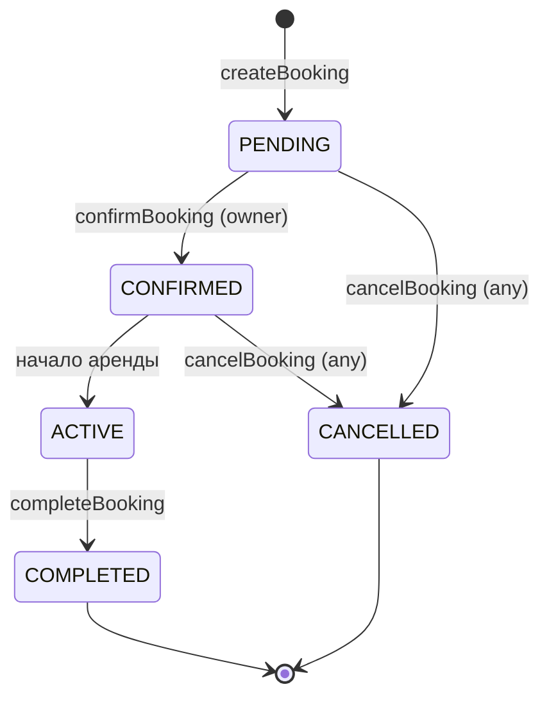

# 🗄️ Сущности базы данных

## users

Основная сущность пользователя. Нет разделения на роли — один юзер может и сдавать и арендовать.

| Поле          | Тип            | Описание                                         |
| ------------- | -------------- | ------------------------------------------------ |
| id            | UUID PK        | Первичный ключ                                   |
| email         | VARCHAR UNIQUE | Email (логин)                                    |
| password_hash | VARCHAR        | Хэш пароля (bcrypt)                              |
| phone         | VARCHAR        | Телефон (показывается после подтверждения брони) |
| first_name    | VARCHAR        | Имя                                              |
| last_name     | VARCHAR        | Фамилия                                          |
| avatar_url    | VARCHAR        | Ссылка на фото профиля (в МВП base64)            |
| is_blocked    | BOOLEAN        | Флаг блокировки аккаунта, проставляется вручную  |
| created_at    | TIMESTAMP      | Дата регистрации                                 |

---

## refresh_tokens

Refresh токены для ротации JWT. Access токен короткоживущий (15 мин), refresh — долгоживущий (30 дней). При логауте или рефреше старый токен инвалидируется.

| Поле       | Тип             | Описание                              |
| ---------- | --------------- | ------------------------------------- |
| id         | UUID PK         | Первичный ключ                        |
| user_id    | UUID FK → users | Владелец токена                       |
| token_hash | VARCHAR UNIQUE  | Хэш refresh токена (не хранить plain) |
| expires_at | TIMESTAMP       | Срок действия                         |
| created_at | TIMESTAMP       | Дата создания                         |
| revoked_at | TIMESTAMP       | Дата отзыва (NULL = активный)         |

> [!info] Стратегия токенов
> - **Access token** — JWT, 15 минут, stateless, проверяется только подписью
> - **Refresh token** — opaque, 30 дней, хранится хэш в БД
> - При `POST /auth/refresh` — старый refresh инвалидируется (`revoked_at`), выдаётся новая пара
> - При `POST /auth/logout` — refresh помечается как отозванный

---

## user_documents

Документы пользователя для верификации.

| Поле                | Тип             | Описание                                  |
| ------------------- | --------------- | ----------------------------------------- |
| id                  | UUID PK         | Первичный ключ                            |
| user_id             | UUID FK → users | Владелец документа                        |
| type                | ENUM            | `driving_license` / `passport` / `selfie` |
| doc_url             | VARCHAR         | Ссылка на файл в Supabase Storage         |
| verification_status | VARCHAR         | `pending` / `verified` / `rejected`       |
| expires_at          | TIMESTAMP       | Срок действия документа                   |

---

## cars

Карточка автомобиля.

| Поле          | Тип             | Описание                                    |
| ------------- | --------------- | ------------------------------------------- |
| id            | UUID PK         | Первичный ключ                              |
| owner_id      | UUID FK → users | Владелец машины                             |
| brand         | VARCHAR         | Марка (Toyota, BMW…)                        |
| model         | VARCHAR         | Модель (Camry, X5…)                         |
| year          | INT             | Год выпуска                                 |
| fuel_type     | ENUM            | `petrol` / `diesel` / `electric` / `hybrid` |
| transmission  | ENUM            | `manual` / `automatic`                      |
| description   | TEXT            | Описание от владельца                       |
| price_per_day | DECIMAL         | Цена аренды за день                         |
| deposit       | DECIMAL         | Залог (депозит)                             |
| car_status    | ENUM            | `active` / `inactive` / `rented`            |
| lat           | DECIMAL         | Широта геолокации                           |
| lng           | DECIMAL         | Долгота геолокации                          |
| address       | VARCHAR         | Текстовый адрес                             |
| created_at    | TIMESTAMP       | Дата создания                               |

> [!info] Геолокация
> В MVP хранятся как два поля `lat` + `lng`. Можно сдлеать для поиска по радиусу -  используется формула Haversine прямо в SQL запросе.

---

## car_photos

Фотографии машины. Отдельная таблица для поддержки нескольких фото.

| Поле       | Тип            | Описание                                             |
| ---------- | -------------- | ---------------------------------------------------- |
| id         | UUID PK        | Первичный ключ                                       |
| car_id     | UUID FK → cars | Машина                                               |
| car_photo_url | VARCHAR     | Ссылка на фото в Supabase Storage (или base64 в МВП) |
| sort_order | INT            | Порядок отображения (0 = главное фото)               |

---

## car_availability

Календарь доступности машины.

| Поле | Тип | Описание |
|------|-----|----------|
| id | UUID PK | Первичный ключ |
| car_id | UUID FK → cars | Машина |
| date_from   | DATE | Начало периода |
| date_to     | DATE | Конец периода |
| period_type | ENUM | `available` / `blocked` |

> [!warning] Логика доступности
> Если у машины нет записей в этой таблице — она считается **всегда доступной** (дефолтная открытость). Записи с `period_type = blocked` закрывают конкретные даты. При поиске система проверяет: нет активных броней И нет `blocked` периодов на запрашиваемые даты.

---

## bookings

Бронирование машины.

| Поле | Тип | Описание |
|------|-----|----------|
| id | UUID PK | Первичный ключ |
| car_id | UUID FK → cars | Арендуемая машина |
| renter_id | UUID FK → users | Арендатор |
| start_at | TIMESTAMP | Начало аренды |
| end_at | TIMESTAMP | Конец аренды |
| total_price | DECIMAL | Итоговая сумма |
| deposit_amount | DECIMAL | Размер депозита |
| booking_status | ENUM | Статус брони (см. ниже) |
| created_at | TIMESTAMP | Дата создания заявки |

### Статус-машина брони

| Статус | Описание |
|--------|----------|
| `PENDING` | Заявка создана, ждёт ответа владельца |
| `CONFIRMED` | Владелец подтвердил |
| `ACTIVE` | Аренда идёт |
| `COMPLETED` | Завершена успешно |
| `CANCELLED` | Отменена любой из сторон |

---

## payments

Платёжная транзакция по брони.

| Поле | Тип | Описание |
|------|-----|----------|
| id | UUID PK | Первичный ключ |
| booking_id | UUID FK → bookings | Бронь |
| amount | DECIMAL | Сумма платежа |
| currency | VARCHAR | Валюта (USD, UAH…) |
| provider | VARCHAR | Платёжная система (stripe, cash) |
| provider_tx_id | VARCHAR | ID транзакции у провайдера |
| status | ENUM | `pending` / `paid` / `refunded` / `failed` |
| paid_at | TIMESTAMP | Время оплаты |

> [!info] MVP
> В MVP `provider = 'cash'`, все транзакции создаются вручную со статусом `paid` после подтверждения передачи ключей.

---

## reviews

Отзывы после завершения аренды.

| Поле       | Тип                | Описание                      |
| ---------- | ------------------ | ----------------------------- |
| id         | UUID PK            | Первичный ключ                |
| author_id  | UUID FK → users | Кто оставил отзыв |
| car_id     | UUID FK → cars  | Машина            |
| rating     | INT             | Оценка 1–5        |
| comment    | TEXT            | Текстовый комментарий |
| created_at | TIMESTAMP       | Дата отзыва       |

> [!info] Standalone таблица
> Пока не привязана к конкретной брони — просто отзыв от пользователя на машину. Связь с `bookings` добавим в v2 когда будет полный цикл завершения аренды.

---

## messages

Сообщения чата в рамках брони.

| Поле       | Тип                | Описание              |
| ---------- | ------------------ | --------------------- |
| id         | UUID PK            | Первичный ключ        |
| booking_id | UUID FK → bookings | Бронь (контекст чата) |
| sender_id  | UUID FK → users    | Отправитель           |
| body       | TEXT               | Текст сообщения       |
| sent_at    | TIMESTAMP          | Время отправки        |

> [!warning] MVP
> Чат отложен. В MVP стороны связываются по телефону.

---

## 🎯 MVP Scope

### Сущности в MVP

| Таблица            | Статус | Комментарий                                     |
| ------------------ | ------ | ----------------------------------------------- |
| `users`            | ✅ MVP  | + поле `is_blocked` для блокировки аккаунта     |
| `cars`             | ✅ MVP  | Полная карточка                                 |
| `car_photos`       | ✅ MVP  | Фото машины                                     |
| `car_availability` | ✅ MVP  | Календарь доступности                           |
| `bookings`         | ✅ MVP  | Без перехода в `ACTIVE` — только до `CONFIRMED` |
| `reviews`          | ✅ MVP  | Только `type: car`, отзывы на пользователя в v2 |
| `user_documents`   | ❌ v2   | Можно заменено полем `is_verified` в `users`    |
| `payments`         | ❌ v2   | Весь модуль отложен, `provider: cash` вручную   |
| `messages`         | ❌ v2   | Чат отложен, стороны общаются по телефону       |

---

### Поля/статусы исключённые из MVP

| Таблица    | Что убрано                           | Причина                                                 |
| ---------- | ------------------------------------ | ------------------------------------------------------- |
| `users`    | `user_documents` (отдельная таблица) | Блокировка через `is_blocked`, проставляется вручную    |
| `bookings` | статус `ACTIVE`                      | `CONFIRMED → COMPLETED` напрямую в MVP                  |

---

### API Эндпоинты MVP (17 штук)

**Auth — 4**

| Метод | Эндпоинт | Описание |
|-------|----------|----------|
| POST | `/auth/register` | Регистрация |
| POST | `/auth/login` | Вход |
| POST | `/auth/logout` | Выход |
| POST | `/auth/refresh` | Обновление токена |

**Users — 3**

| Метод | Эндпоинт | Описание |
|-------|----------|----------|
| GET | `/users/me` | Свой профиль |
| PATCH | `/users/me` | Обновить профиль |
| POST | `/users/me/avatar` | Загрузить аватар |

**Cars — 5**

| Метод | Эндпоинт | Описание |
|-------|----------|----------|
| GET | `/cars` | Поиск с фильтрами |
| GET | `/cars/me` | Мои машины |
| GET | `/cars/:id` | Детали машины |
| POST | `/cars` | Создать машину |
| PATCH | `/cars/:id` | Редактировать машину |

**Availability — 3**

| Метод | Эндпоинт | Описание |
|-------|----------|----------|
| GET | `/cars/:id/availability` | Календарь доступности |
| POST | `/cars/:id/availability` | Добавить период |
| DELETE | `/cars/:id/availability/:slotId` | Удалить период |

**Bookings — 5**

| Метод | Эндпоинт                | Описание              |
| ----- | ----------------------- | --------------------- |
| POST  | `/bookings`             | Создать заявку        |
| GET   | `/bookings/my`          | Мои брони (арендатор) |
| GET   | `/bookings/incoming`    | Входящие (владелец)   |
| PATCH | `/bookings/:id/confirm` | Подтвердить           |
| PATCH | `/bookings/:id/cancel`  | Отменить              |

---

## Связанные страницы

- [[api-endpoints]] — REST эндпоинты
