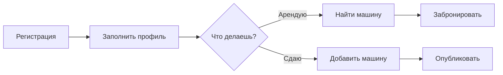

---
tags:
  - carsharing
  - project
  - index
created: 2025-05-10
related:
cssclasses:
---

# 🚗 CarSharing P2P — Документация проекта

> [!info] О проекте
> P2P платформа для аренды автомобилей между частными лицами. Пользователь может одновременно сдавать свои машины и арендовать чужие — без жёстких ролей, как на OLX.

## Навигация

| Раздел               | Описание                                       |
| -------------------- | ---------------------------------------------- |
| [[project-overview]] | Описание продукта, цели, MVP                   |
| [[user-flow-renter]] | Флоу арендатора — найти и забронировать машину |
| [[user-flow-owner]]  | Флоу владельца — сдать машину                  |
| [[pages-frontend]]   | Все страницы фронтенда                         |
| [[entities]]         | Сущности базы данных                           |
| [[api-endpoints]]    | Полный список REST эндпоинтов (38 шт.)         |
| [[mvp-scope]]        | Упрощённый MVP — 17 эндпоинтов                 |

## Стек

```
Frontend   React / Next.js
Backend    NestJS (Node.js)
API        REST API
Database   PostgreSQL via Supabase
Storage    Supabase Storage (фото)
Auth       JWT (access + refresh tokens)
```

## Команда и ресурсы

| Ресурс                    | Ссылка                                                                                                                                                    |
| ------------------------- | --------------------------------------------------------------------------------------------------------------------------------------------------------- |
| Zoom встречи              | [us02web.zoom.us/j/84171723335](https://us02web.zoom.us/j/84171723335)                                                                                    |
| Описание идеи (Mural)     | [app.mural.co — lunarcarsharing](https://app.mural.co/t/lunarcarsharing6383/m/lunarcarsharing6383/1778265169667/343aa7bd990825880eab80a0d99c2a04e1ce6bf5) |
| Схема БД — MVP (DrawSQL)  | [diagrams/car](https://drawsql.app/teams/serhii-hliievyi/diagrams/car)                                                                                    |
| Схема БД — Full (DrawSQL) | [diagrams/carprod](https://drawsql.app/teams/serhii-hliievyi/diagrams/carprod)                                                                            |
| Frontend — GitHub         | [lanaogini/car-rental-app](https://github.com/lanaogini/car-rental-app)                                                                                   |
| Backend — GitHub          | — *(скоро)*                                                                                                                                               |

---

## Быстрый старт


