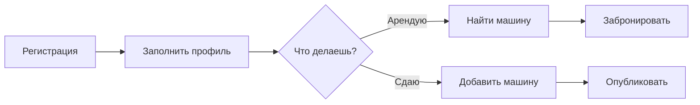

---
tags:
  - carsharing
  - project
  - index
created: 2025-05-10
related:
cssclasses:
---

# 🚗 CarSharing P2P — Документация проекта

> [!info] О проекте
> P2P платформа для аренды автомобилей между частными лицами. Пользователь может одновременно сдавать свои машины и арендовать чужие — без жёстких ролей, как на OLX.

## Навигация

| Раздел               | Описание                                       |
| -------------------- | ---------------------------------------------- |
| [[project-overview]] | Описание продукта, цели, MVP                   |
| [[user-flow-renter]] | Флоу арендатора — найти и забронировать машину |
| [[user-flow-owner]]  | Флоу владельца — сдать машину                  |
| [[pages-frontend]]   | Все страницы фронтенда                         |
| [[entities]]         | Сущности базы данных                           |
| [[api-endpoints]]    | Полный список REST эндпоинтов (38 шт.)         |
| [[mvp-scope]]        | Упрощённый MVP — 17 эндпоинтов                 |

## Стек

```
Frontend   React / Next.js
Backend    NestJS (Node.js)
API        REST API
Database   PostgreSQL via Supabase
Storage    Supabase Storage (фото)
Auth       JWT (access + refresh tokens)
```

## Быстрый старт


