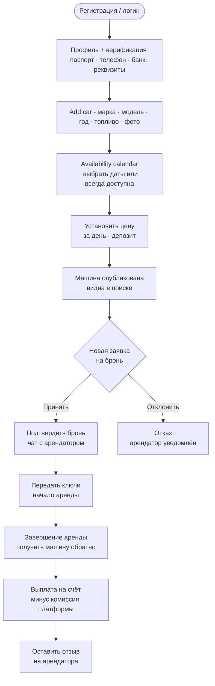

# 🚙 Флоу владельца — сдать машину

## Диаграмма

## Шаги подробно

### 1. Регистрация и профиль

- То же что и для арендатора
- Дополнительно: банковские реквизиты для получения выплат
- В MVP выплаты — наличными, реквизиты не нужны

### 2. Добавление автомобиля

**Обязательные поля:**

- Марка и модель
- Год выпуска
- Тип топлива
- Коробка передач
- Цена за день
- Депозит
- Фото (минимум 1)
- Адрес / геолокация

**Опциональные поля:**

- Описание (особенности, правила)
- Дополнительные фото

### 3. Настройка доступности

> [!info] Логика доступности
> По умолчанию машина **не доступна**. Владелец явно указывает периоды когда машина доступна. Либо ставит флаг "всегда доступна" — тогда записей в `car_availability` нет, машина всегда открыта для брони.

**Варианты:**

- Конкретные даты: выбрать диапазон в календаре → тип `AVAILABLE`
- Заблокировать даты (машина занята/на ТО) → тип `BLOCKED`
- "Всегда доступна" — дефолтное состояние без записей

### 4. Цена

- Цена за день (обязательно)
- Депозит (необязательно, защита от ущерба)
- В MVP нет почасовой аренды — только посуточно

### 5. Публикация

- После заполнения всех полей машина получает статус `ACTIVE`
- Появляется в результатах поиска
- Владелец может в любой момент снять с публикации → статус `INACTIVE`

### 6. Обработка заявок

- Уведомление о новой заявке (email (в МВП нету) / в МВП толкьо in-app)
- Видит: кто хочет арендовать, на какой период, итоговая сумма
- Может **подтвердить** → бронь переходит в `CONFIRMED`
- Может **отклонить** → бронь переходит в `CANCELLED`, арендатор уведомлён

> [!warning] Таймаут подтверждения
> Рекомендуется ввести таймаут: если владелец не ответил за 24 часа — бронь автоматически отменяется. В MVP можно пропустить.

### 7. Передача машины

- Стороны связываются по телефону
- Владелец передаёт ключи
- Статус брони → `ACTIVE`

### 8. Завершение и выплата

- Арендатор вернул машину
- Статус → `COMPLETED`
- В реальном проекте: выплата на счёт минус комиссия платформы
- В MVP: расчёт наличными при передаче

## Управление парком машин

Владелец может иметь **несколько машин**. Для каждой:

- Отдельный календарь доступности
- Отдельная история броней
- Отдельная статистика и рейтинг

## Связанные страницы

- [[pages-frontend#Owner dashboard]] — дашборд владельца
- [[entities#cars]] — сущность машины
- [[entities#car_availability]] — доступность
- [[api-endpoints#Cars]] — эндпоинты машин
