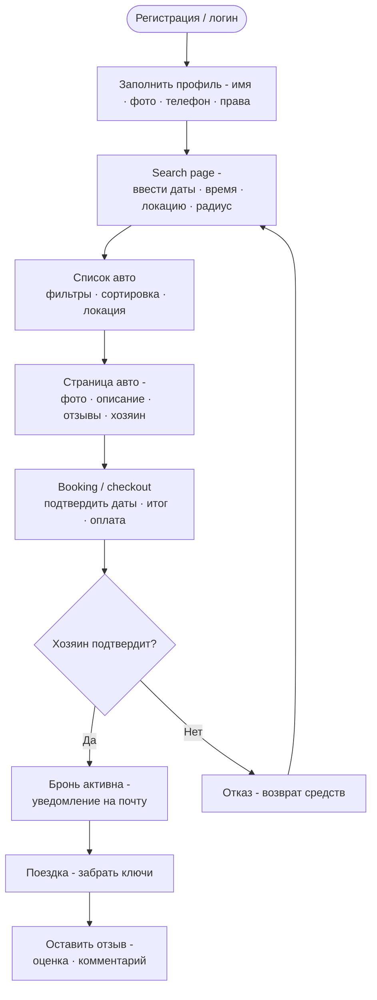

# 🔍 Флоу арендатора — взять машину

## Диаграмма



## Шаги подробно

### 1. Регистрация / логин

- Email + пароль
- После регистрации → верификация email
- Связанная страница: [[pages-frontend#Auth]]

### 2. Заполнение профиля

- Имя, фамилия, телефон, фото
- Загрузка водительского удостоверения
- Без верификации документов в MVP — просто загрузка файла

> [!info] MVP упрощение
> Конфирм меил, Верификация документов в MVP не реализована.

### 3. Поиск машины

**Входные параметры:**

- Дата и время начала аренды
- Дата и время окончания аренды
- Или тогл "дотсупна всегда"
- Геолокация  - название города

**Фильтры:**

- Тип топлива (бензин / дизель / электро / гибрид)
- Коробка передач (механика / автомат)
- Количество мест
- Максимальная цена в день

### 4. Список результатов

- Карточки машин с фото, маркой, ценой, рейтингом
- Сортировка: по цене, по рейтингу, по расстоянию

### 5. Страница автомобиля

- Галерея фото
- Характеристики (год, топливо, КПП, мест)
- Описание от владельца
- Профиль владельца (имя, рейтинг, кол-во сдач)
- Отзывы предыдущих арендаторов
- Календарь доступности
- Кнопка "Забронировать"

### 6. Бронирование / Checkout

- Подтверждение выбранных дат
- Итоговая сумма = кол-во дней × цена + депозит
- В MVP: `payment_method: cash` — оплата при получении
- Создаётся бронь со статусом `PENDING`

### 7. Ожидание подтверждения

- Владелец получает уведомление
- Может подтвердить или отклонить
- Арендатор получает уведомление о решении

### 8. Поездка

- Стороны связываются по телефону (в MVP чата нет)
- Арендатор забирает ключи
- Статус брони → `ACTIVE`

### 9. Завершение

- Статус брони → `COMPLETED`
- Арендатор оставляет отзыв на машину и владельца

## Статусы брони в этом флоу

```
PENDING → CONFIRMED → ACTIVE → COMPLETED
                              ↘ CANCELLED
```

## Связанные страницы

- [[pages-frontend]] — все экраны этого флоу
- [[entities#bookings]] — сущность брони
- [[api-endpoints#Bookings]] — эндпоинты броней
